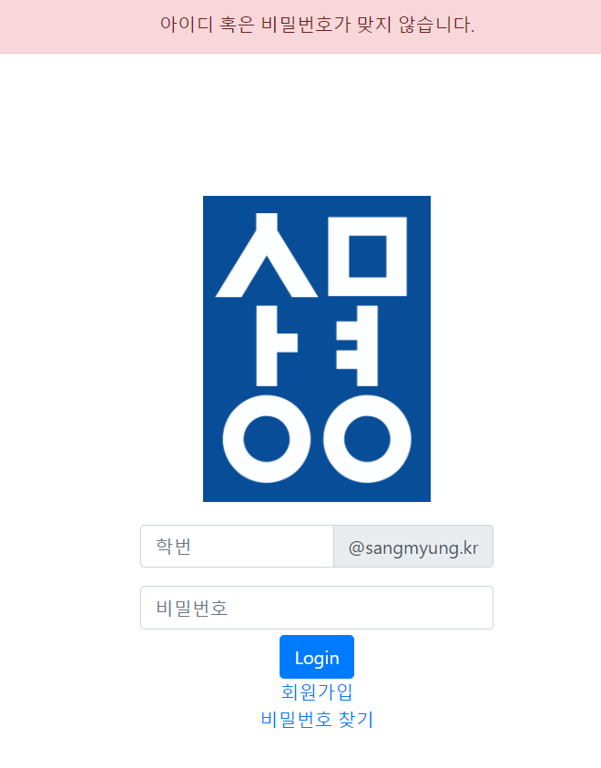

# README

# COMNET(프로젝트 모집 서비스)

## 개발하게 된 계기

학교에서 졸업 프로젝트를 할 때 팀원을 구하지 못하면 과 사무실에 요청을 해서 모르는 사람과 랜덤으로 팀을 꾸려야 하는 것이 비효율적이라 생각하여 최소 팀원이 될 사람의 능력을 알고나서 팀을 꾸리게 된다면 졸업프로젝트를 하는 데 있어서 효율적이라 생각하였고, 또한 졸업 프로젝트 뿐만이 아닌 IT관련 공모전을 나가게 될 때 지인들이랑 하면 좋지만, 그렇지 못할 때 사용하면 좋을 것 같아 개발하게 되었습니다.

## 사용한 기술

### MYSQL + MyBatis

### Spring Framework 5.2.3.RELEASE

### Spring Security 5.4.1.RELEASE

### Eclipes + STS

### HTML/CSS + JS + JQuery

## 기능

### 로그인

### 회원가입

-회원가입은 학번과 이름 등등을 받으며, 학교 이메일로 인증을 받습니다.

### 비밀번호 찾기

-비밀번호 찾기 역시 학교 이메일로 인증을 받고, 비밀번호 변경을 할 수 있습니다.

### 프로젝트 관련

- 사이드 메뉴에서 프로젝트의 모집 언어와 분야를 선택해 적합한 프로젝트를 조회할 수 있습니다.
- 프로젝트 작성자는 프로젝트 지원자의 정보를 조회할 수 있습니다.
- 프로젝트 작성자와 팀원은 팀원의 정보를 조회할 수 있습니다.
- 다른 인원의 프로젝트에 지원할 수 있습니다.

### 마이페이지

### 알림

## 결과

학교 사람들이 많이 사용할 것이라 생각하고 우선 에브리타임과 설문조사를 통해 반응을 살폈고, 생각보다 반응이 좋지 못했습니다. 

1. 에브리타임과 캠퍼스픽이라는 좋은 서비스가 있어서, 이를 대체할 만한 서비스가 
아니라 면 굳이 사용할 필요가 없다고 느낌

2. 졸업 프로젝트 팀원들이 렌덤인 것이 나의 생각과는 달리 큰 불만이 아니라고 느낌

원래는 배포를 할 예정이였으나, 현재는 개인 프로젝트로 남겨둘 예정입니다.
